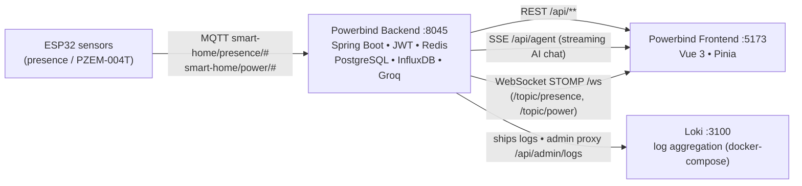

# Powerbind — Backend

IoT Smart Home Energy Management backend with an integrated **multimodal AI agent**.
Built with **Java 17 + Spring Boot 3.4.5 (Maven)**.

---

## What is this backend for?

**Powerbind** is the server side of a home power-usage management system. Devices and a Vue 3 frontend (separate app, default `http://localhost:5173`) talk to this API. It is responsible for:

| Area | What it does |
|---|---|
| **Presence detection** | Subscribes to MQTT (`smart-home/presence/#`) from room sensors and tracks which rooms are occupied |
| **Power monitoring** | Ingests `smart-home/power/#` readings from PZEM-004T sensors (Watts, Voltage, Current, kWh) and stores them as time-series in **InfluxDB** |
| **Relay / room state** | Keeps per-room state in PostgreSQL; a watchdog (`RoomTimeoutService`) auto-marks rooms *offline* after ~30 s without MQTT data |
| **Real-time updates** | Broadcasts presence & power changes to the frontend over **WebSocket STOMP** (`/ws` → `/topic/presence`, `/topic/power`) |
| **AI energy advisor** | Groq-powered agent: streaming text chat (SSE), image queries (vision), voice input (Whisper transcription), and document Q&A (PDF/DOCX/TXT) — all persisted into **per-user conversation threads** with long-term memory |
| **Auth & security** | JWT access + refresh tokens with a role claim (`USER`/`ADMIN`), Redis sliding-window rate limiting (30 req/60 s), login lockout (5 failed attempts → 10 min) |
| **Admin — ERD & logs** | Admin-only API: auto-generated ERD schema (`/api/admin/erd`, reflects the live JPA entities) and the merged Backend/Frontend/IoT log stream proxied from Loki (`/api/admin/logs`) |
| **Observability** | Logs ship to **Loki**, dashboards in **Grafana** (see `docker-compose.yml`) |



---

## Tech stack

- **Core:** Java 17, Spring Boot 3.4.5, Spring Security, Spring Data JPA, WebSocket (STOMP), WebFlux (SSE)
- **Storage:** PostgreSQL (+ Flyway migrations), InfluxDB (time-series), Redis (rate limiting)
- **IoT:** Eclipse Paho MQTT (Mosquitto broker)
- **AI:** Groq API (OpenAI-compatible: chat, vision, Whisper, document parsing)
- **Docs:** springdoc-openapi (Swagger UI)
- **Testing:** JUnit 5, Mockito, RestAssured, Cucumber, Selenium, Allure reporting

---

## Getting the repo (clone / pull)

```bash
# First time — clone
git clone https://github.com/nxstray/powerbind-backend.git
cd powerbind-backend

# Later — get the latest changes
git pull origin main
```

---

## Prerequisites

| Tool | Version | Needed for |
|---|---|---|
| Java (JDK) | 17+ | building/running |
| Maven | 3.8+ | build & test |
| PostgreSQL | 14+ | main database |
| Redis | 7+ | rate limiting |
| Mosquitto (MQTT broker) | 2.x | device communication |
| InfluxDB | 2.x | power time-series |
| Groq API key | — | AI agent features ([console.groq.com](https://console.groq.com)) |
| Docker + Docker Compose | — | Loki + Grafana observability |
| Allure CLI | 2.x | test reports (optional) |
| Google Chrome | — | Selenium UI tests (driver auto-managed) |

---

## Configuration (`.env`)

All credentials come from a `.env` file in the project root (loaded via `spring.config.import=optional:file:.env[.properties]`). **Never commit `.env`.**

```bash
cp .env.example .env   # then fill in the real values
```

| Variable | Required | Default | Description |
|---|---|---|---|
| `DB_USERNAME` / `DB_PASSWORD` | yes | — | PostgreSQL credentials |
| `JWT_SECRET` | yes | — | Long random secret for signing tokens |
| `INFLUXDB_TOKEN` | yes | — | InfluxDB API token |
| `GROQ_API_KEY` | yes | — | Groq API key |
| `JWT_EXPIRATION` | — | `3600000` | Access token lifetime (ms) |
| `JWT_REFRESH_EXPIRATION` | — | `604800000` | Refresh token lifetime (ms) |
| `REDIS_HOST` / `REDIS_PORT` | — | `localhost:6379` | Redis connection |
| `MQTT_BROKER_URL` | — | `tcp://localhost:1883` | Mosquitto broker |
| `INFLUXDB_URL` / `_ORG` / `_BUCKET` | — | `http://localhost:8086` / `powerbind` / `smarthome` | InfluxDB connection |
| `GROQ_MAX_TOKENS` | — | `1024` | AI response cap |
| `CORS_ALLOWED_ORIGINS` | — | `http://localhost:5173` | Frontend origin |
| `APP_DEFAULT_USER_USERNAME` / `_PASSWORD` | — | `admin` / *(none)* | Initial admin account, created on first startup |
| `APP_FAMILY_USERS` | — | — | Multiple accounts, overrides the default admin. Format: `user:pass:Display;user2:pass2:Display2` |
| `LOKI_URL` | — | `http://localhost:3100` | Loki base URL for the admin log proxy (`/api/admin/logs`) |

> **Accounts:** there is **no self-registration**. Users are seeded on startup by `DataInitializer` from `.env` (passwords stored bcrypt-hashed). The single default user becomes **ADMIN** (gets the ERD/Log pages); with `APP_FAMILY_USERS` everyone starts as **USER** — promote someone with `UPDATE users SET role = 'ADMIN' WHERE username = '...';`

### Database

1. Create a database named `powerbind` in PostgreSQL.
2. Schema is managed by Flyway SQL migrations in `src/main/resources/db/migration` (`V1` … `V10`).
3. JPA is set to `ddl-auto=validate` — the schema must exist before startup.

---

## Running the backend

```bash
mvn spring-boot:run
```

- **API base:** `http://localhost:8045`
- **Swagger UI:** `http://localhost:8045/swagger-ui.html`
- **Health check:** `http://localhost:8045/actuator/health`

Production-style build & run:

```bash
mvn clean package
java -jar target/backend-0.0.1-SNAPSHOT.jar
```

---

## Docker Compose (Loki + Grafana)

```bash
docker compose up -d      # start
docker compose down       # stop
```

| Service | URL | Notes |
|---|---|---|
| Grafana | http://localhost:3000 | login `admin` / `admin` — explore logs & dashboards |
| Loki | http://localhost:3100 | log aggregation target |

> Note: Compose runs the **observability stack only** — the backend itself is still started with Maven (see above).

---

## Running tests & the `.ps1` scripts

| Script | What it runs | Prerequisites |
|---|---|---|
| `.\run-test.ps1` | Default suite: **unit, functional, smoke, Cucumber BDD** (H2 in-memory DB — no external services needed) | Java + Maven |
| `.\run-performance-test.ps1` | Only `@Tag("performance")` tests (30-user concurrent login load test, login performance) | Java + Maven |
| `.\run-selenium-test.ps1 -Username <user> -Password <secure>` | Only `@Tag("ui")` Selenium tests (Login, Dashboard, AgentPage, ChangePasswordModal, AnomalyToast, ERD, Log) | Backend **and** frontend already running; Chrome installed |
| `.\run-allure.ps1 [-Clean]` | Generates & opens the **combined Allure report** (merges results from the other scripts, keeps trend history) | Allure CLI; run it *after* at least one test script |

```powershell
# If script execution is blocked on your machine:
powershell -ExecutionPolicy Bypass -File .\run-test.ps1

# Typical flow:
.\run-test.ps1                    # 1. default suite
.\run-performance-test.ps1        # 2. load tests (optional)
.\run-selenium-test.ps1 -Username alice   # 3. UI tests — password prompted securely (hidden)
.\run-allure.ps1                  # 4. open combined Allure report
```

Notes:
- Performance (`performance`) and UI (`ui`) tests are **excluded by default** in `pom.xml` (`excludedGroups=requires-groq,performance,ui`), so plain `mvn test` never runs them.
- Selenium credentials are passed as system properties (`-Dselenium.username/-Dselenium.password`) — never hardcoded; headless Chrome via WebDriverManager.
- All results accumulate in `target/allure-results`; use `.\run-allure.ps1 -Clean` for a fresh report.

---

## User guide (using the API)

All responses are wrapped in `ApiResponse<T>` → `{ "message": "...", "data": ... }`. Authenticate with `Authorization: Bearer <accessToken>`.

### 1. Login (get tokens)

```bash
curl -X POST http://localhost:8045/api/auth/login \
  -H "Content-Type: application/json" \
  -d '{"username":"alice","password":"password123"}'
# → data.accessToken (1 h), data.refreshToken (7 days)
```

### 2. Profile

```bash
curl http://localhost:8045/api/auth/me -H "Authorization: Bearer $TOKEN"          # who am I
curl -X PUT http://localhost:8045/api/auth/profile -H "Authorization: Bearer $TOKEN" \
  -H "Content-Type: application/json" -d '{"displayName":"Alice"}'                # rename
```

### 3. Keep the session alive

```bash
curl -X POST http://localhost:8045/api/auth/refresh -H "Content-Type: application/json" \
  -d '{"refreshToken":"<refreshToken>"}'     # new access token
curl -X POST http://localhost:8045/api/auth/logout -H "Authorization: Bearer $TOKEN" \
  -d '{"refreshToken":"<refreshToken>"}'     # revoke & end session
```

### 4. Dashboard & rooms

```bash
curl http://localhost:8045/api/dashboard/summary         -H "Authorization: Bearer $TOKEN"  # rooms, power, cost
curl "http://localhost:8045/api/dashboard/power-history" -H "Authorization: Bearer $TOKEN"  # chart data (last 24 h)
curl http://localhost:8045/api/rooms                     -H "Authorization: Bearer $TOKEN"  # list / create / update / delete rooms
```

### 5. AI agent (streaming chat)

`/api/agent/chat`, `/api/agent/vision`, and `/api/agent/document` stream the answer as **Server-Sent Events**:

```bash
curl -N -X POST http://localhost:8045/api/agent/chat \
  -H "Authorization: Bearer $TOKEN" -H "Content-Type: application/json" \
  -d '{"message":"How much energy did the living room use today?"}'
```

- Voice input: `POST /api/agent/transcribe` (audio file → text via Whisper)
- Documents: `POST /api/agent/document` (PDF/DOCX/TXT + question)
- Conversation history: `GET /api/agent/conversations`, `GET /api/agent/conversations/{id}`, `DELETE /api/agent/conversations/{id}` — **strictly per-user** (one account can never see another's threads). Long-term memory extraction runs automatically in the background.

### 6. Real-time updates (frontend)

Connect a STOMP client to **`/ws`** and subscribe to `/topic/presence` and `/topic/power` for live room/power events.

### 7. Devices (MQTT contract)

ESP32 sensors publish to:

| Topic | Payload |
|---|---|
| `smart-home/presence/#` | room presence events |
| `smart-home/power/#` | PZEM-004T readings (Watts, Voltage, Current, kWh) |

### 8. Admin — ERD & logs (ADMIN only)

Both endpoints are gated by `hasRole('ADMIN')` — the role is embedded in the JWT at login and turned into a `ROLE_ADMIN` authority by `JwtAuthFilter`.

```bash
# Auto-generated entity schema (tables, columns, relations) — always mirrors the live JPA entities
curl http://localhost:8045/api/admin/erd -H "Authorization: Bearer $TOKEN"

# Merged Backend/Frontend/IoT log stream, proxied from Loki (Loki's URL never reaches the browser)
curl "http://localhost:8045/api/admin/logs?source=ALL&since=1h&limit=300" -H "Authorization: Bearer $TOKEN"
#   source: ALL | BACKEND | FRONTEND | IOT      level: ERROR | WARN | INFO | DEBUG
#   search: free-text line filter               since: 15m / 1h / 6h / 24h
```

### Security defaults

- Rate limit: **30 requests / 60 s** per client (Redis sliding window)
- Login lockout: **5 failed attempts → 10 minutes**
- Role-based access: `/api/admin/**` requires the `ADMIN` role (role claim in the JWT)

---

## Project structure

```
src/main/java/com/powerbind/backend/
├── config/          # Security, MQTT, Redis, InfluxDB, WebSocket, DataInitializer (user seeding)
├── controller/      # REST endpoints: /api/auth, /api/agent, /api/dashboard, /api/rooms, /api/logs,
│                    #   /api/admin (ERD schema + Loki log proxy — ADMIN only)
├── service/         # Business logic: AuthService, AgentService, GroqService, MqttMessageHandler,
│                    #   InfluxDBService, MemoryService, RoomTimeoutService (watchdog)
├── repository/      # Spring Data JPA repositories
├── model/           # JPA entities: User (+ Role enum), Room, ChatMessage, Conversation, RefreshToken, UserMemory
├── security/        # JWT filter & utilities
└── data/            # request/ + response/ DTOs
src/test/java/       # unit/ functional/ performance/ selenium/ cucumber/
src/main/resources/
├── application.properties
└── db/migration/    # Flyway SQL migrations
```

---

## License

Private project — all rights reserved.
